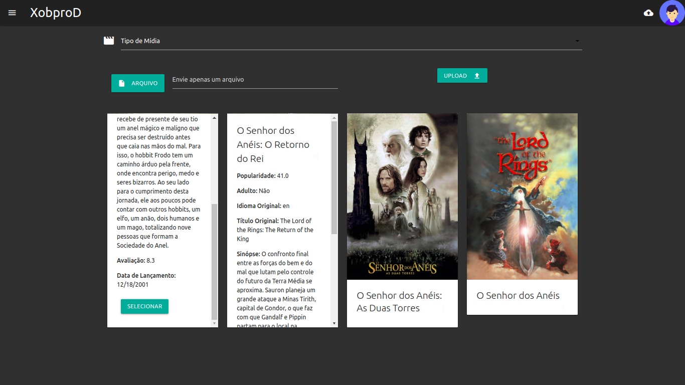
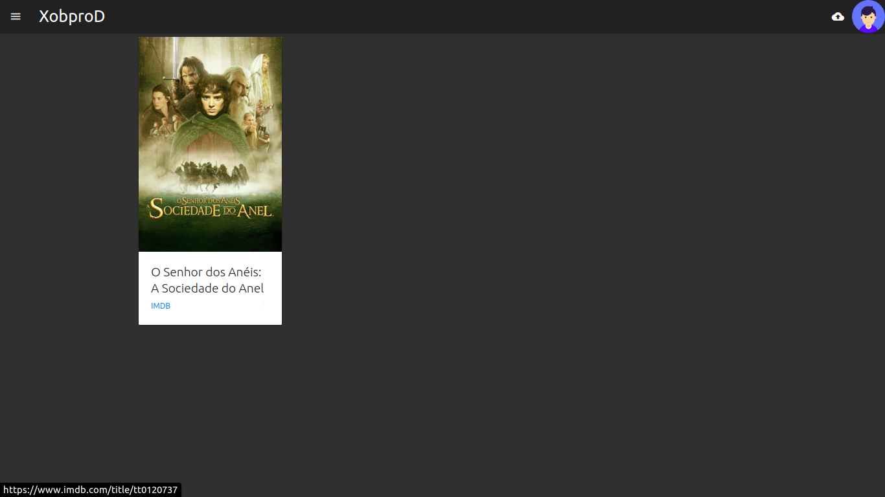
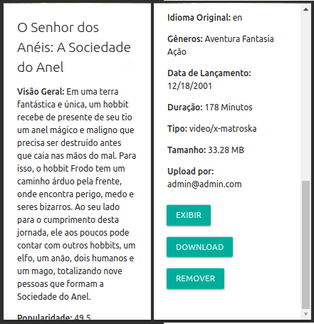

# XobporD - Armazenamento de vídeos, fotos e áudios

<!--- Exemplos de badges. Acesse https://shields.io para outras opções. Você pode querer incluir informações de dependencias, build, testes, licença, etc. --->

[](http://standardjs.com)


XobporD tem como objetivo permitir que os usuários, de forma simples, armazenem e visualizem seus arquivos de vídeo, fotos e também áudios.

Aplicação para armazenamento local de vídeos, fotos e áudios em que você poderá acessa-lo de qualquer dispositivo que tenha conexão com a mesma rede.
É possível a pré-visualização e o download dos arquivos em outros dispositivos, sejam eles móveis ou desktops.

## Pré-requisitos

Antes de iniciar, certifique-se de cumprir os seguintes requisitos:

#### Sistema Operacional

- `Linux`.

#### Você deve possuir as seguintes aplicações:

- `Docker`
- `Docker-compose`

## Como executar

Para fazer o deploy da aplicação siga os seguintes passos:

Clone o repositório;

- Linux:

```shell
cd XobporD-progweb
docker-compose build
docker-compose up -d
```

Usuário _admin_, responsável pelo gerenciamento dos demais usuários:

```shell
email: admin@admin.com
password: admin
```

## Usando XobporD

Para usar XobporD, siga os seguintes passos (exemplos):

- Abra o navegador e digite o seguinte endereço: http://localhost:3000
- Realize login com o usuário _admin_
- Ao logar na aplicação você poderá:
  - Enviar arquivos de vídeo, imagem ou áudio (_upload_)
  - Pré-visualiza-los no navegador
  - Baixá-los no seu computador
  - Remové-los
- Ao enviar arquivos como filmes ou séries é possível fazer uso da [TMDB API](https://developers.themoviedb.org/3/getting-started/introduction) para sua correnta identificação e descrição



- Após enviado é possível visualizar todas as informação da mídia





## Contribuidores

As seguintes pessoas contribuiram para este projeto:

- [Rafael Junio Xavier](https://github.com/rafael-junio)
- [Diego Bulhões Moraes](https://github.com/DiegoBulhoes/)
- [Jhonatan Froeder](https://github.com/froeder)
- [Guilherme Ribeiro Carvalho](https://github.com/guilhermercarvalho)

## Licença de uso

Este projeto usa a seguinte licença: [MIT](https://choosealicense.com/licenses/mit/).
